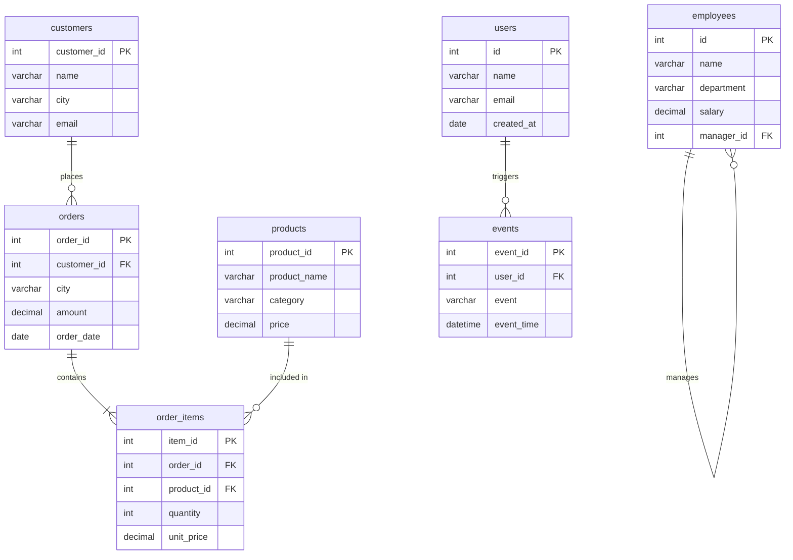

# CTEs

## 🧠 The Real Problem (Why CTE feels hard)

You’re likely:

- Trying to write the final query directly
- Not breaking the problem into logical steps
- Not thinking of CTE as a temporary table

👉 Truth:
A CTE is just a way to say:

“Let me solve this problem step-by-step, like I would in Excel or Python.”

## 🔁 The Mindset Shift (Very Important)

Instead of:
❌ “How do I write this in one SQL query?”

Think:
✅ “What are the intermediate steps to reach the answer?”

## 🧩 CTE = Step-by-Step Thinking

### Template:

```sql
WITH step1 AS (
    -- first transformation
),
step2 AS (
    -- use step1
),
step3 AS (
    -- use step2
)
SELECT * FROM step3;
```

## 🧠 How to Think Logically (Framework)

Whenever you see a question, ask:

### 1. What is the FINAL OUTPUT?

- Columns?
- Aggregation?
- Filtering?

### 2. What do I need BEFORE that?

Break it into steps like:

- Step 1: Clean / filter data
- Step 2: Group / aggregate
- Step 3: Rank / compare
- Step 4: Final result

The dataset below can be used for solving all the examples and questions given in this file



## 🔥 Example (Let’s Train Your Brain)

### Problem:

> Find the **highest spending customer in each city**

## ❌ Wrong Approach (what you're probably doing)

Trying to write everything at once → confusion

## ✅ Correct Thinking

### Step 1: Total spending per customer

```sql
WITH customer_spending AS (
    SELECT 
        customer_id,
        city,
        SUM(amount) AS total_spent
    FROM orders
    GROUP BY customer_id, city
)
```

### Step 2: Rank customers within each city

```sql
, ranked_customers AS (
    SELECT *,
           RANK() OVER (PARTITION BY city ORDER BY total_spent DESC) AS rnk
    FROM customer_spending
)
```

### Step 3: Pick top customer

```sql
SELECT *
FROM ranked_customers
WHERE rnk = 1;
```

## 💡 Key Insight

Each CTE answers **one small question**:

- “What is total spending?”
- “Who ranks highest?”
- “Give me top ones”

👉 You’re not solving ONE problem
👉 You’re solving MANY SMALL problems

## 🧠 Practice Method (This will fix your issue FAST)

Do this for every question:

### Step 1: Don’t touch SQL yet ❌

Write in plain English:

Example:

- Get total per customer
- Rank them
- Filter top 1

### Step 2: Convert each line → one CTE

## 🏋️ Practice Exercise (Try this)

### Question:

> Find customers whose spending is above average

Try breaking it like:

- Step 1: total per customer
- Step 2: overall average
- Step 3: filter customers > average

## 🧠 Pro Tip (Game changer)

If you're stuck:

👉 Ask yourself:

> “Can I solve this using Excel steps?”

If yes → convert each step into a CTE

## ⚠️ Common Mistakes

- Using CTE when not needed (overcomplicating)
- Not naming CTEs meaningfully
- Skipping intermediate steps
- Writing everything in one CTE

## 🧠 Think of CTEs as “Problem Patterns”

There are ~**7 major CTE patterns** used in real-world SQL.

I’ll explain each with:

- 🧩 When to use
- 🧠 How to think
- 💻 Example

## 🔹 1. Aggregation Pattern (Most Common)

### 🧩 Use when:

You need totals, averages, counts before doing something else.

### 🧠 Thinking:

> “First calculate summary → then use it”

## 💻 Example:

**Find customers who spent more than 5000**

```sql
WITH customer_totals AS (
    SELECT customer_id, SUM(amount) AS total_spent
    FROM orders
    GROUP BY customer_id
)
SELECT *
FROM customer_totals
WHERE total_spent > 5000;
```

## 🔹 2. Ranking Pattern

### 🧩 Use when:

Top N, highest, lowest, leaderboard

### 🧠 Thinking:

> “First compute → then rank → then filter”

## 💻 Example:

**Top 2 highest paid employees per department**

```sql
WITH ranked_emp AS (
    SELECT *,
           RANK() OVER (PARTITION BY department ORDER BY salary DESC) AS rnk
    FROM employees
)
SELECT *
FROM ranked_emp
WHERE rnk <= 2;
```

## 🔹 3. Filtering in Steps (Layered Filtering)

### 🧩 Use when:

Conditions are complex

### 🧠 Thinking:

> “Filter step by step instead of all at once”

## 💻 Example:

**Customers who ordered in 2023 AND spent > 1000**

```sql
WITH orders_2023 AS (
    SELECT *
    FROM orders
    WHERE YEAR(order_date) = 2023
),
high_spenders AS (
    SELECT customer_id, SUM(amount) AS total
    FROM orders_2023
    GROUP BY customer_id
)
SELECT *
FROM high_spenders
WHERE total > 1000;
```

## 🔹 4. Comparison Pattern (Self vs Overall)

### 🧩 Use when:

Compare row value vs average / max / min

### 🧠 Thinking:

> “Get overall metric → compare each row”

## 💻 Example:

**Employees earning above company average**

```sql
WITH avg_salary AS (
    SELECT AVG(salary) AS avg_sal FROM employees
)
SELECT e.*
FROM employees e, avg_salary a
WHERE e.salary > a.avg_sal;
```

## 🔹 5. Deduplication Pattern

### 🧩 Use when:

Remove duplicates

### 🧠 Thinking:

> “Rank duplicates → keep one”

## 💻 Example:

**Remove duplicate emails**

```sql
WITH ranked_emails AS (
    SELECT *,
           ROW_NUMBER() OVER (PARTITION BY email ORDER BY id) AS rn
    FROM users
)
SELECT *
FROM ranked_emails
WHERE rn = 1;
```

## 🔹 6. Sequential / Funnel Pattern

### 🧩 Use when:

Steps in order (user journey, events)

### 🧠 Thinking:

> “Break journey into stages”

## 💻 Example:

**Users who signed up → then purchased**

```sql
WITH signup_users AS (
    SELECT user_id
    FROM events
    WHERE event = 'signup'
),
purchased_users AS (
    SELECT user_id
    FROM events
    WHERE event = 'purchase'
)
SELECT s.user_id
FROM signup_users s
JOIN purchased_users p
ON s.user_id = p.user_id;
```

## 🔹 7. Recursive CTE (Advanced)

### 🧩 Use when:

Hierarchy (tree, org chart)

### 🧠 Thinking:

> “Start from root → keep expanding”

## 💻 Example:

**Employee hierarchy**

```sql
WITH RECURSIVE emp_hierarchy AS (
    SELECT id, name, manager_id
    FROM employees
    WHERE manager_id IS NULL

    UNION ALL

    SELECT e.id, e.name, e.manager_id
    FROM employees e
    JOIN emp_hierarchy eh
    ON e.manager_id = eh.id
)
SELECT * FROM emp_hierarchy;
```

## 🔥 BONUS Pattern (Very Important)

## 🔹 8. Multi-Step Transformation (Real Interview Pattern)

### 🧩 Use when:

Complex problems

### 🧠 Thinking:

> “Break problem into pipeline”

## 💻 Example:

**Top city by revenue**

```sql
WITH city_revenue AS (
    SELECT city, SUM(amount) AS revenue
    FROM orders
    GROUP BY city
),
ranked_city AS (
    SELECT *,
           RANK() OVER (ORDER BY revenue DESC) AS rnk
    FROM city_revenue
)
SELECT *
FROM ranked_city
WHERE rnk = 1;
```

## 🧠 How to Practice (IMPORTANT)

Don’t memorize queries ❌
Recognize patterns ✅

### When you see a question:

Ask:

- Is this aggregation?
- Is this ranking?
- Is this comparison?
- Is this step-by-step filtering?

Let's take **one pattern at a time** and gradually make it more complex so your brain learns how to *build CTE chains*.

We’ll focus on **progressive difficulty**.

## 🧩 PATTERN 1: Aggregation → Filtering → Ranking (Progressive Build)

### 🟢 LEVEL 1 — Simple Aggregation

#### Problem:

Find total spending per customer

#### 🧠 Thinking:

- I just need totals → one step

```sql
WITH customer_totals AS (
    SELECT customer_id, SUM(amount) AS total_spent
    FROM orders
    GROUP BY customer_id
)
SELECT * FROM customer_totals;
```

### 🟡 LEVEL 2 — Add Filtering

#### Problem:

Customers who spent more than 5000

#### 🧠 Thinking:

- Step 1: total per customer
- Step 2: filter

```sql
WITH customer_totals AS (
    SELECT customer_id, SUM(amount) AS total_spent
    FROM orders
    GROUP BY customer_id
)
SELECT *
FROM customer_totals
WHERE total_spent > 5000;
```

### 🟠 LEVEL 3 — Add Ranking

#### Problem:

Top 3 customers by spending

#### 🧠 Thinking:

- Step 1: totals
- Step 2: rank
- Step 3: filter rank

```sql
WITH customer_totals AS (
    SELECT customer_id, SUM(amount) AS total_spent
    FROM orders
    GROUP BY customer_id
),
ranked_customers AS (
    SELECT *,
           RANK() OVER (ORDER BY total_spent DESC) AS rnk
    FROM customer_totals
)
SELECT *
FROM ranked_customers
WHERE rnk <= 3;
```

### 🔴 LEVEL 4 — Add Partitioning (Real Interview Level)

#### Problem:

Top 2 customers per city

#### 🧠 Thinking:

- Step 1: totals per customer per city
- Step 2: rank within each city
- Step 3: filter

```sql
WITH customer_totals AS (
    SELECT customer_id, city, SUM(amount) AS total_spent
    FROM orders
    GROUP BY customer_id, city
),
ranked_customers AS (
    SELECT *,
           RANK() OVER (PARTITION BY city ORDER BY total_spent DESC) AS rnk
    FROM customer_totals
)
SELECT *
FROM ranked_customers
WHERE rnk <= 2;
```

### 🧨 LEVEL 5 — Add Another Layer (Advanced Thinking)

#### Problem:

Find cities where **top customer spends more than 10000**

#### 🧠 Thinking:

- Step 1: totals
- Step 2: rank per city
- Step 3: get top customer
- Step 4: filter cities

```sql
WITH customer_totals AS (
    SELECT customer_id, city, SUM(amount) AS total_spent
    FROM orders
    GROUP BY customer_id, city
),
ranked_customers AS (
    SELECT *,
           RANK() OVER (PARTITION BY city ORDER BY total_spent DESC) AS rnk
    FROM customer_totals
),
top_customers AS (
    SELECT *
    FROM ranked_customers
    WHERE rnk = 1
)
SELECT *
FROM top_customers
WHERE total_spent > 10000;
```

## 🧩 PATTERN 2: Comparison (Row vs Overall) → Multi-Step

### 🟢 LEVEL 1 — Basic Comparison

#### Problem:

Employees earning above average

```sql
WITH avg_salary AS (
    SELECT AVG(salary) AS avg_sal FROM employees
)
SELECT *
FROM employees e, avg_salary a
WHERE e.salary > a.avg_sal;
```

### 🟡 LEVEL 2 — Add Aggregation

#### Problem:

Departments where avg salary > company avg

#### 🧠 Thinking:

- Step 1: company avg
- Step 2: department avg
- Step 3: compare

```sql
WITH company_avg AS (
    SELECT AVG(salary) AS avg_sal FROM employees
),
dept_avg AS (
    SELECT department, AVG(salary) AS dept_avg_sal
    FROM employees
    GROUP BY department
)
SELECT *
FROM dept_avg d, company_avg c
WHERE d.dept_avg_sal > c.avg_sal;
```

### 🔴 LEVEL 3 — Add Filtering + Ranking

#### Problem:

Top departments whose avg salary > company avg

```sql
WITH company_avg AS (
    SELECT AVG(salary) AS avg_sal FROM employees
),
dept_avg AS (
    SELECT department, AVG(salary) AS dept_avg_sal
    FROM employees
    GROUP BY department
),
filtered AS (
    SELECT *
    FROM dept_avg d, company_avg c
    WHERE d.dept_avg_sal > c.avg_sal
),
ranked AS (
    SELECT *,
           RANK() OVER (ORDER BY dept_avg_sal DESC) AS rnk
    FROM filtered
)
SELECT *
FROM ranked
WHERE rnk <= 3;
```

## 🧩 PATTERN 3: Event / Funnel (VERY IMPORTANT FOR DATA ANALYST)

### 🟢 LEVEL 1 — Simple Step Match

#### Problem:

Users who signed up and purchased

```sql
WITH signup AS (
    SELECT user_id FROM events WHERE event = 'signup'
),
purchase AS (
    SELECT user_id FROM events WHERE event = 'purchase'
)
SELECT s.user_id
FROM signup s
JOIN purchase p ON s.user_id = p.user_id;
```

### 🟡 LEVEL 2 — Add Time Logic

#### Problem:

Users who purchased AFTER signup

```sql
WITH signup AS (
    SELECT user_id, MIN(event_time) AS signup_time
    FROM events
    WHERE event = 'signup'
    GROUP BY user_id
),
purchase AS (
    SELECT user_id, MIN(event_time) AS purchase_time
    FROM events
    WHERE event = 'purchase'
    GROUP BY user_id
)
SELECT s.user_id
FROM signup s
JOIN purchase p 
ON s.user_id = p.user_id
WHERE p.purchase_time > s.signup_time;
```

### 🔴 LEVEL 3 — Full Funnel

#### Problem:

Users who completed:
signup → add_to_cart → purchase

```sql
WITH signup AS (
    SELECT user_id, MIN(event_time) AS t1
    FROM events WHERE event = 'signup'
    GROUP BY user_id
),
cart AS (
    SELECT user_id, MIN(event_time) AS t2
    FROM events WHERE event = 'add_to_cart'
    GROUP BY user_id
),
purchase AS (
    SELECT user_id, MIN(event_time) AS t3
    FROM events WHERE event = 'purchase'
    GROUP BY user_id
)
SELECT s.user_id
FROM signup s
JOIN cart c ON s.user_id = c.user_id
JOIN purchase p ON s.user_id = p.user_id
WHERE t1 < t2 AND t2 < t3;
```

## 🧠 WHAT YOU SHOULD NOTICE

As complexity increases:

- You add **more CTEs**
- Each CTE = **one logical step**
- Final query = just combining steps

## 🚨 Golden Rule

👉 If your CTE has too much logic → break it
👉 If you're confused → you're skipping steps
